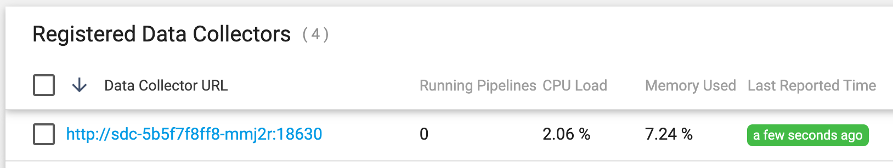

## deploying-registered-sdc-on-k8s-without-control-agent

### Overview

This project provides an example of manually deploying a Control Hub-registered SDC on k8s without using a Control Agent or a Control Hub Deployment.  This approach may be necessary if users do not have sufficient RBAC permissions to deploy Control Agent.

The main challenge in manual deployment is ensuring that SDC's auth token remains valid across SDC Pod death and recreation. (This is one of the main features of Control Agent: watching for new SDC Pods and dynamically generating auth tokens for them.)

A couple of points to keep in mind:

- Although SDC deployment is performed outside of Control Hub, SDC will register with Control Hub and serve as a fully functional Execution or Authoring SDC.  

- Only one instance of SDC per deployment is supported, in order to associate the SDC with its auth token. If multiple instances of SDC are needed, one can use multiple manual deployments of one instance each, or one can create a deployment with multiple instances using Control Agent.

- HPA's are not supported.   If an HPA is needed, use Control Agent.

### Configure the Example

- Clone this project to your local machine.

- Edit the file <code>deploy-sdc.sh</code> and set these variables at the top of the file:

        SCH_ORG=<Control Hub Org>               
        SCH_URL=<Control Hub URL>         
        SCH_USER=<user>@<org>           
        SCH_PASSWORD=<Control Hub password>          
        KUBE_NAMESPACE=<namespace for the SDC>
        
  For example, my settings look like this::

        SCH_ORG=schbrooks               
        SCH_URL=https://cloud.streamsets.com         
        SCH_USER=mark@schbrooks           
        SCH_PASSWORD=password123         
        KUBE_NAMESPACE=ns1

- Edit the ConfigMap <code>yaml/dpm-configmap.yaml</code> and set the following properties:

  If you are using your own Control Hub rather than <code>https://cloud.streamsets.com</code>, set your own Control Hub URL like this:
  
        dpm.base.url=https://sch.onefoursix.com
  
  Set one or more Labels for the SDC in a comma-delimited string like this:
  
        dpm.remote.control.job.labels=auth-sdc,us-west-2
        
  This ConfigMap will be mounted as <code>$SDC_CONF/dpm.properties</code>
    

- Edit <code>yaml/sdc.yaml</code> and adjust properties as needed.

### Deploy the Example
  
- Execute the <code>deploy-sdc.sh</code> script.  

  The script performs the following steps:
  
  - Creates the target namespace if it does not exist
  - Generates an <code>sdc.id</code> and stores it in a Secret
  - Generates a Control Hub auth token for SDC and stores it in a Secret
  - Creates a ConfigMap to hold <code>dpm.properties</code> values
  - Creates an SDC Deployment with Volume Mounts for the Secrets and ConfigMap
  
   When you run the script you should see output like this:

        $ ./deploy-sdc.sh
        namespace/ns1 created
        Context "mark-aks-1" modified.
        Generated sdc.id 5ee148aa-ddef-4251-81e1-d37f47fabf24
        secret/sdc-id created
        Generated an Auth Token for SDC
        secret/sdc-auth-token created
        configmap/dpm-config created
        deployment.apps/sdc created
        
  After a minute or so you should see the registered SDC show up in Control Hub's Execute >  Data Collector List, with the specified Labels:
  
  
  
  Note that you won't be able to reach that SDC in your Browser until you configure ingress for it (see the Ingress Examples [here](https://github.com/streamsets/tutorials/tree/master/tutorial-kubernetes-deployment/8-ingress)). 
  

- You can test that the SDC's auth token remains valid by deleting the SDC's Pod and waiting for it get recreated.  The new Pod should resume heart-beating to Control Hub and function normally.
   
